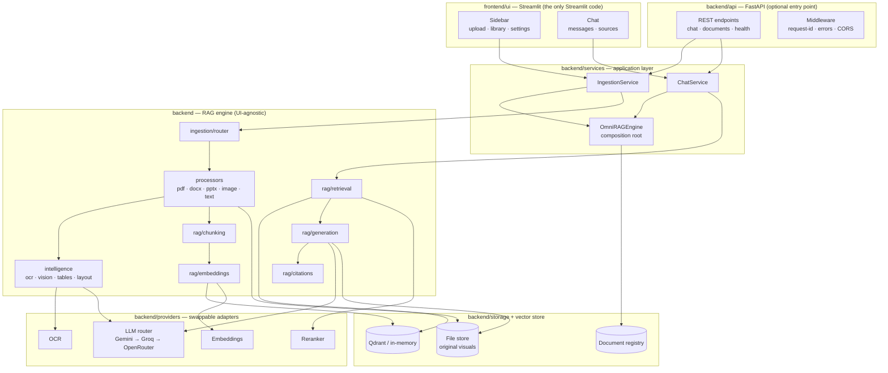
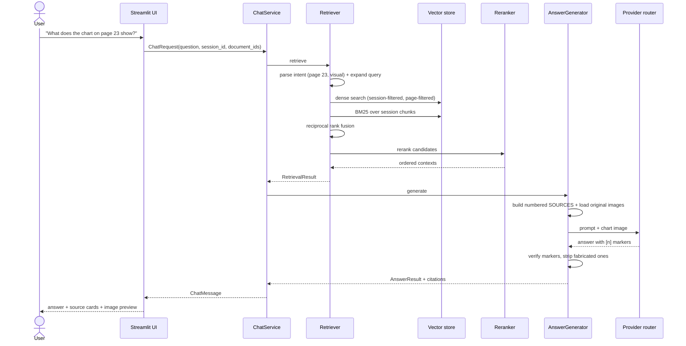
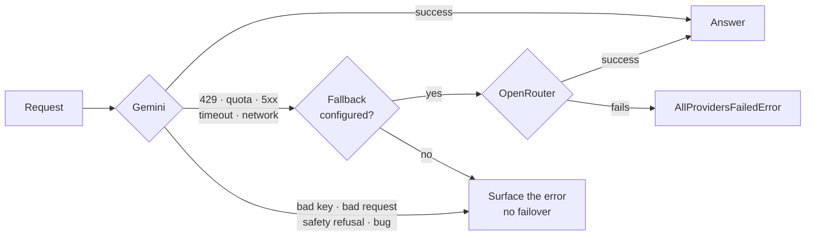
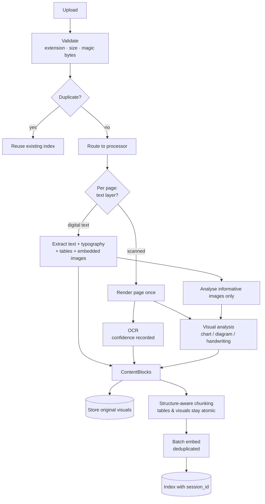

# OmniRAG

**Medical Document Intelligence & RAG Platform**

Upload medical documents, research papers, clinical guidelines or reports — and
ask questions. OmniRAG reads the text *and* the visuals, retrieves across
languages, and cites the exact page behind every claim.

**Disclaimer**: This system is for educational and informational purposes only.
It does not provide medical advice, diagnosis, or treatment recommendations.
Always consult a qualified healthcare professional for clinical decisions.

```bash
# Streamlit UI
streamlit run main.py

# FastAPI backend
uvicorn backend.api.app:app --reload
```

---

## Table of contents

1. [What OmniRAG is](#1-what-omnirag-is)
2. [Features](#2-features)
3. [Architecture](#3-architecture)
4. [Supported files](#4-supported-files)
5. [The multimodal pipeline](#5-the-multimodal-pipeline)
6. [Local setup](#6-local-setup)
7. [Provider configuration](#7-provider-configuration)
8. [Qdrant setup](#8-qdrant-setup)
9. [Running the app](#9-running-the-app)
10. [Pushing to GitHub](#10-pushing-to-github)
11. [Deploying to Streamlit Community Cloud](#11-deploying-to-streamlit-community-cloud)
12. [Secrets configuration](#12-secrets-configuration)
13. [Testing](#13-testing)
14. [Project structure](#14-project-structure)
15. [Limitations](#15-limitations)
16. [Security & privacy](#16-security--privacy)
17. [Roadmap](#17-roadmap)

---

## 1. What OmniRAG is

Most "chat with your PDF" tools run OCR over everything, throw the pictures
away, and answer from a bag of text. That fails exactly where documents are most
valuable: the chart on page 23, the flowchart in the appendix, the table of
figures, the handwritten margin note, the Arabic scan.

OmniRAG is built around three commitments:

- **Visual content is understood, not flattened.** Charts, diagrams, tables and
  scans get a faithful semantic description for retrieval, *and* the original
  image is kept. When such a source is retrieved, the image itself is sent to
  the multimodal model.
- **Every answer is traceable.** `Answer → Citation → SearchResult → Chunk →
  ContentBlock → Page → Document`. Citation markers are verified against the
  sources that were actually supplied; a reference the model invented is
  stripped and reported, never rendered.
- **Arabic is a first-class language.** Arabic-aware normalisation, tokenisation
  and RTL rendering throughout, plus cross-lingual retrieval — ask in Arabic
  about an English PDF, or the reverse.

---

## 2. Features

**Documents**
- PDF (digital and scanned), DOCX, PPTX, TXT, Markdown, JPG/JPEG, PNG, WebP
- Per-page scan detection — digital text is never needlessly OCR'd
- Tables extracted with structure, Markdown and a factual summary preserved
- Running headers/footers detected and removed from the index
- Deduplication by content hash; the same file is never processed twice

**Understanding**
- Chart reading: title, axes, legend, series, approximate values, trends
- Diagram reading: components, labels, arrows, sequence, hierarchy
- OCR with confidence reporting (vision-model or local Tesseract)
- Handwriting extraction, explicitly flagged as low-confidence
- Native PPTX chart data read from the file's own XML — no model guessing

**Retrieval**
- Hybrid: dense vectors + BM25, combined with reciprocal rank fusion
- Arabic-aware BM25 (diacritic stripping, alef/yeh unification, char n-grams)
- Query intent parsing: "page 17", "الصفحة ٢٣", "slide 4", "compare A and B",
  "answer in Arabic"
- Optional LLM query expansion including a cross-lingual variant
- Reranking: Cohere / Jina / LLM / zero-cost heuristic fallback
- Metadata filtering by document, page, block type, language

**Answers**
- Grounded prompt: cite or admit insufficiency, never fabricate
- Original images attached to the request for visual sources
- Multi-document reasoning and comparison
- Source panel with page, content type, passage and image preview
- Conversation memory that never becomes evidence

**Operations**
- Gemini → Groq → OpenRouter Free, with classified capability-aware failover
- Session isolation enforced inside the vector store, not by callers
- Graceful degradation at every provider boundary
- Evaluation module: Recall@K, Precision@K, MRR, nDCG, citation coverage,
  numeric fidelity, CER/WER

---

## 3. Architecture



### Request flow



### Provider failover



Only *recoverable* provider-side conditions cross the provider boundary. An
invalid API key, a malformed request, a safety refusal or a programming bug
fails immediately — a second vendor would fail identically, and retrying only
burns quota and hangs the UI.

### Layering rule

Imports point downwards only:

```
ui → services → {ingestion, rag} → {intelligence, providers} → core
```

**Nothing outside `frontend/ui` imports Streamlit.** This is enforced by a test
(`tests/integration/test_app_startup.py::TestUIIndependence`), and it is what
makes the FastAPI migration a matter of adding an entry point rather than a
rewrite.

---

## 4. Supported files

| Format | Extensions | What is extracted |
|---|---|---|
| PDF | `.pdf` | Text with typography, layout, tables, embedded images, page renders for scans |
| Word | `.docx` | Headings, paragraphs, tables, embedded media, document order |
| PowerPoint | `.pptx` | Slide text, titles, tables, native chart data, pictures, speaker notes |
| Text | `.txt` | Paragraphs, encoding detection (UTF-8/16, CP1256, ISO-8859-6) |
| Markdown | `.md`, `.markdown` | Headings, tables, code fences, sections |
| Images | `.jpg`, `.jpeg`, `.png`, `.webp` | Visual analysis, OCR, handwriting, classification |

**Adding a format** (XLSX, HTML) is one file plus one line: write a processor
subclassing `BaseDocumentProcessor` and register it in
`backend/ingestion/router.py`. Everything downstream is format-agnostic because
every processor emits the same canonical `Document`.

---

## 5. The multimodal pipeline



**The multimodal retrieval rule.** Visual blocks store two things: a semantic
description (what makes them findable by vector search) and a `VisualRef`
pointing at the original bytes in the file store. When such a chunk is
retrieved, `AnswerGenerator` loads the image and attaches it to the LLM request.
The description gets it found; the image is what gets reasoned over.

**Cost control.** Blank and decorative images are filtered before any API call;
visual analyses are memoised by image hash; a per-document budget caps visual
calls; one call returns both the description and the transcription; identical
chunk texts are embedded once. Digital text is never OCR'd.

---

## 6. Local setup

**Requirements:** Python 3.10+ (3.11 or 3.12 recommended), git.

```bash
git clone https://github.com/<your-username>/omnirag.git
cd omnirag
```

```bash
python -m venv .venv
```

Windows (PowerShell):

```bash
.venv\Scripts\Activate.ps1
```

macOS / Linux:

```bash
source .venv/bin/activate
```

```bash
pip install -r requirements.txt
```

Then create your configuration:

```bash
copy .env.example .env
```

(macOS/Linux: `cp .env.example .env`)

Open `.env` and add at least one API key. **`.env` is git-ignored — never commit
it.**

---

## 7. Provider configuration

Every setting is read in one place (`backend/config.py`); no other
module calls `os.getenv`.

### The LLM chain: Gemini → Groq → OpenRouter Free

```bash
LLM_PROVIDER_CHAIN=gemini,groq,openrouter
PRIMARY_LLM_PROVIDER=gemini
ENABLE_PROVIDER_FALLBACK=true

GEMINI_API_KEY=...              # https://aistudio.google.com/apikey
GEMINI_MODEL=gemini-3.6-flash

GROQ_API_KEY=...                # https://console.groq.com/keys
GROQ_MODEL=openai/gpt-oss-20b
GROQ_VISION_MODEL=qwen/qwen3.6-27b

OPENROUTER_API_KEY=...          # https://openrouter.ai/keys
OPENROUTER_MODEL=openrouter/free
OPENROUTER_FREE_FALLBACK=true
```

Providers without credentials are skipped, so partial configurations work:

| Configured | Behaviour |
|---|---|
| Gemini + Groq + OpenRouter | Gemini, then Groq, then OpenRouter Free |
| Gemini + Groq | Gemini primary, automatic failover to Groq |
| Groq + OpenRouter | Groq primary, automatic failover to OpenRouter Free |
| Gemini only | Works normally, no failover (a note is shown in the UI) |
| Groq only | Groq becomes the active provider |
| OpenRouter only | OpenRouter becomes the active provider |
| Neither | A clear configuration error in the UI — the app does not crash |

**The default uses OpenRouter's official free router.** It dynamically selects
a currently available free model and filters routes using the request's image
and structured-output requirements. If no compatible free multimodal route is
available, OmniRAG reports that explicitly instead of dropping the chart.
Concrete OpenRouter model IDs remain supported. Override detection with
`OPENROUTER_MODEL_SUPPORTS_IMAGES=true|false` if you know better.

Groq uses its official OpenAI-compatible endpoint. The default production text
model is `openai/gpt-oss-20b`; visual requests use the explicitly image-capable
`qwen/qwen3.6-27b`. Unknown Groq models are treated as text-only unless
`GROQ_MODEL_SUPPORTS_IMAGES=true` is set. `GROK_API_KEY` remains a deprecated
alias, but `GROQ_API_KEY` always wins.

Other vendors (`openai`, `anthropic`, any OpenAI-compatible gateway via
`LLM_BASE_URL`) can be included in `LLM_PROVIDER_CHAIN`. The legacy primary and
fallback variables remain supported.

### Complete variable reference

| Variable | Default | Purpose |
|---|---|---|
| `LLM_PROVIDER_CHAIN` | `gemini,groq,openrouter` | Ordered provider chain; missing credentials are skipped |
| `PRIMARY_LLM_PROVIDER` | `gemini` | First provider in the chain |
| `FALLBACK_LLM_PROVIDER` | — | Legacy single-fallback control |
| `ENABLE_PROVIDER_FALLBACK` | `true` | Master switch for failover |
| `GEMINI_API_KEY` / `GEMINI_MODEL` | — / `gemini-3.6-flash` | Primary credentials |
| `GROQ_API_KEY` / `GROQ_MODEL` | — / `openai/gpt-oss-20b` | Canonical Groq credentials and fast text model |
| `GROQ_VISION_MODEL` | `qwen/qwen3.6-27b` | Groq model used only for requests containing images |
| `OPENROUTER_API_KEY` / `OPENROUTER_MODEL` | — / `openrouter/free` | Fallback credentials and dynamic free route |
| `OPENROUTER_FREE_FALLBACK` | `true` | Retry an explicitly configured credit-requiring route once through `openrouter/free` |
| `PROVIDER_RATE_LIMIT_COOLDOWN_SECONDS` | `60` | Per-session, per-provider cooldown after 429 |
| `PROVIDER_HARD_QUOTA_COOLDOWN_SECONDS` | `3600` | Session-scoped cooldown when a provider reports exhausted account/daily quota without a reset time |
| `GROQ_MAX_RATE_LIMIT_WAIT_SECONDS` | `20` | Wait once for a Groq `Retry-After` at or below this bound; otherwise fail over immediately |
| `GROQ_TPM_LIMIT` | `8000` | Conservative per-request TPM preflight ceiling |
| `GROQ_FOCUSED_VISION_MAX_OUTPUT_TOKENS` | `1024` | Focused multimodal Groq completion ceiling; required images remain attached |
| `VISION_MODEL` | = LLM model | Model used for visual analysis |
| `LLM_TEMPERATURE` | `0.1` | Generation temperature |
| `LLM_MAX_OUTPUT_TOKENS` | `2048` | Focused-answer output budget |
| `LLM_EXHAUSTIVE_MAX_OUTPUT_TOKENS` | `4096` | Global/exhaustive output budget |
| `LLM_TIMEOUT_S` | `90` | Per-request timeout |
| `LLM_RETRY_ATTEMPTS` | `2` | Quick retries before failing over |
| `MAX_VISUALS_PER_QUERY` | `3` | Visual budget per answer (`MAX_IMAGES_PER_ANSWER` remains a legacy alias) |
| `EMBEDDING_PROVIDER` | auto | `openai` \| `gemini` \| `cohere` \| `jina` \| `hash` |
| `EMBEDDING_API_KEY` / `EMBEDDING_MODEL` | auto / `gemini-embedding-001` with Gemini | Optional dedicated embedding credentials/model; `GEMINI_API_KEY` is reused for Gemini |
| `QDRANT_URL` / `QDRANT_API_KEY` | — | Vector database (empty = in-memory) |
| `QDRANT_COLLECTION` | `omnirag_chunks` | Collection name |
| `RERANK_PROVIDER` | `auto` | `cohere` \| `jina` \| `llm` \| `heuristic` \| `none` |
| `RERANK_API_KEY` / `RERANK_MODEL` | — | Reranker credentials |
| `OCR_PROVIDER` | `auto` | `vision` \| `tesseract` \| `none` |
| `OCR_LANGUAGES` | `ara+eng` | Tesseract language packs |
| `VISION_ENABLED` | `true` | Master switch for visual understanding |
| `VISION_LAZY_ANALYSIS` | `true` | Store visuals during ingestion and understand only retrieved pages |
| `VISION_ANALYSIS_MAX_TOKENS` / `VISION_OCR_MAX_TOKENS` | `800` / `1200` | Combined visual-description and exceptional standalone OCR budgets |
| `MAX_IMAGES_PER_DOCUMENT` | `40` | Visual-analysis budget per document |
| `PAGE_RENDER_DPI` | `170` | Render resolution for scanned pages |
| `CHUNK_SIZE` / `CHUNK_OVERLAP` | `1100` / `150` | Chunking (characters) |
| `TOP_K` / `RERANK_TOP_K` | `24` / `8` | Candidates fetched / contexts used |
| `EXHAUSTIVE_SCAN_MAX_CHUNKS` / `EXHAUSTIVE_FINAL_K` | `120` / `24` | Bounded full-scan threshold and broad-query context limit |
| `RETRIEVAL_STRATEGY` | `hybrid` | `hybrid` \| `vector` \| `keyword` |
| `QUERY_REWRITE` | `true` | LLM query expansion |
| `QUERY_REWRITE_MAX_TOKENS` / `RERANK_MAX_TOKENS` | `256` / `256` | Auxiliary LLM operation ceilings |
| `MAX_UPLOAD_MB` / `MAX_FILES` | `50` / `25` | Upload limits |
| `LOG_LEVEL` / `DEBUG_PANELS` | `INFO` / `false` | Server logging and non-sensitive diagnostics |
| `OMNIRAG_DEBUG_GENERATION` | `false` | Internal generation diagnostics, including provider/model details; keep disabled for normal users |

### Embeddings are independent of the LLM chain

Deliberately so: a Gemini outage must never invalidate vectors already written
to Qdrant, and switching answering models must not force a re-index. If no
embedding key is configured, OmniRAG falls back to an offline hashing
vectoriser — it keeps the app running, but it is **lexical only, with no
cross-lingual retrieval**, and the UI says so plainly. Configure a real
embedding provider for production.

---

## 8. Qdrant setup

Without `QDRANT_URL`, OmniRAG uses an in-memory store: fully functional, but the
index is lost on every restart (and Streamlit Cloud restarts often).

**Qdrant Cloud (free tier):**

1. Create a cluster at <https://cloud.qdrant.io>
2. Copy the cluster URL and an API key
3. Set:

```bash
QDRANT_URL=https://xxxxxxxx.eu-central.aws.cloud.qdrant.io:6333
QDRANT_API_KEY=your-key
QDRANT_COLLECTION=omnirag_chunks
```

**Local Qdrant (Docker, development only):**

```bash
docker run -p 6333:6333 -v qdrant_storage:/qdrant/storage qdrant/qdrant
```

Then `QDRANT_URL=http://localhost:6333`.

The collection is created automatically on first use, with payload indexes on
`session_id`, `document_id`, `block_type` and `page_number` so filtering stays
fast as it grows.

---

## 9. Running the app

```bash
streamlit run main.py
```

Opens at <http://localhost:8501>.

Windows, from a clean checkout:

```bash
python -m venv .venv; .venv\Scripts\Activate.ps1; pip install -r requirements.txt; streamlit run main.py
```

---

## 10. Pushing to GitHub

```bash
git init
```

```bash
git add .
```

Verify no secrets are staged before the first commit:

```bash
git status --short
```

`.env` and `.streamlit/secrets.toml` must **not** appear (they are git-ignored).

```bash
git commit -m "Initial commit: OmniRAG multimodal RAG platform"
```

```bash
git branch -M main
```

```bash
git remote add origin https://github.com/<your-username>/omnirag.git
```

```bash
git push -u origin main
```

---

## 11. Deploying to Streamlit Community Cloud

1. Push the repository to GitHub (above).
2. Go to <https://share.streamlit.io> and sign in with GitHub.
3. **New app** → select your repository.
4. Set:
   - **Branch:** `main`
   - **Main file path:** `main.py`
   - **Python version:** 3.11 or 3.12
5. Open **Advanced settings → Secrets** and paste your configuration (see
   [section 12](#12-secrets-configuration)).
6. **Deploy.**

The first build takes a few minutes while wheels install. Every dependency in
`requirements.txt` ships manylinux wheels and needs no `apt` packages, so no
`packages.txt` is required.

**Only if you want local Tesseract OCR** (the default OCR path is the vision
API and needs none of this), add a `packages.txt` containing:

```
tesseract-ocr
tesseract-ocr-ara
tesseract-ocr-eng
```

…and add `pytesseract` to `requirements.txt`.

**Sizing note.** Community Cloud gives roughly 1 GB of RAM. The defaults are
tuned for it: parsing is local and light, all heavy intelligence is an API call,
and the vector index lives in Qdrant rather than in the app's memory.

---

## 12. Secrets configuration

**Local:** copy `.streamlit/secrets.toml.example` to
`.streamlit/secrets.toml` (git-ignored) — or just use `.env`.

**Cloud:** paste into *App settings → Secrets*:

```toml
LLM_PROVIDER_CHAIN = "gemini,groq,openrouter"
PRIMARY_LLM_PROVIDER = "gemini"
ENABLE_PROVIDER_FALLBACK = "true"

GEMINI_API_KEY = "your-gemini-key"
GEMINI_MODEL = "gemini-3.6-flash"

GROQ_API_KEY = "your-groq-key"
GROQ_MODEL = "openai/gpt-oss-20b"
GROQ_VISION_MODEL = "qwen/qwen3.6-27b"

OPENROUTER_API_KEY = "your-openrouter-key"
OPENROUTER_MODEL = "openrouter/free"
OPENROUTER_FREE_FALLBACK = true

QDRANT_URL = "https://xxxxxxxx.eu-central.aws.cloud.qdrant.io:6333"
QDRANT_API_KEY = "your-qdrant-key"
QDRANT_COLLECTION = "omnirag_chunks"
```

Sectioned TOML works too:

```toml
[llm]
api_key = "..."
model = "gemini-3.6-flash"

[qdrant]
url = "..."
api_key = "..."
```

Precedence: real environment variables → `.env` → Streamlit secrets. Secrets are
copied into the environment by `backend/config.py` *before* settings are read,
which is what keeps the engine free of any Streamlit import.

Secrets are never logged: a redacting filter masks anything key-shaped before a
record is emitted, and `AppSettings.redacted()` masks credentials recursively
for the debug panel.

---

## 13. Testing

```bash
pip install -r requirements-dev.txt
```

```bash
pytest
```

**539 tests, no API keys required** — every external provider is mocked, and no
test opens a socket.

Run a subset:

```bash
pytest tests/unit -q
```

```bash
pytest tests/integration -q
```

```bash
pytest tests/unit/test_provider_fallback.py -v
```

With coverage:

```bash
pytest --cov=backend --cov-report=term-missing
```

Import/syntax validation:

```bash
python -m compileall -q backend frontend
```

### What is covered

| Area | Examples |
|---|---|
| Provider fallback | 429 / quota / timeout / 5xx → failover; bad key / refusal / bug → no failover; all four configuration combinations; capability handling |
| Session isolation | Cross-session leakage, identical vectors, foreign-chunk writes, filter scoping, registry and file-store separation |
| Citations | Marker parsing, fabricated-reference stripping, coverage, Arabic answers |
| Chunking | Atomic tables/visuals, page boundaries, heading sections, overlap, OCR provenance, stable ids |
| Ingestion | PDF/DOCX/PPTX/text/image processors, encodings, corrupted files, blank images |
| Retrieval | BM25, RRF, page-intent filtering, document filtering, broken-reranker degradation |
| Generation | Prompt contract, image attachment, budget, insufficient evidence, capability retry |
| Config | Parsing, validation, secret redaction, secrets bootstrap |
| Evaluation | Recall/Precision/MRR/nDCG, citation coverage, numeric fidelity, CER/WER |
| FastAPI | Endpoint tests (health, chat, documents), middleware, error handlers, request-id |
| Medical metadata | Keyword extraction, document type/domain detection, evidence levels |
| Architecture | Every module imports; no engine module imports Streamlit; repo hygiene |

---

## 14. Project structure

```
backend/
├── __init__.py
├── models.py                # Document, Page, ContentBlock, Chunk, Citation, medical models
├── config.py                # Settings, bootstrap, env loading
├── utils.py                 # Utility functions, log redaction
├── errors.py                # Exception hierarchy
├── storage.py               # FileStore, DocumentRegistry
├── services.py              # OmniRAGEngine, ChatService, IngestionService
├── ingestion/               # Document processing package
│   ├── __init__.py
│   ├── base.py              # BaseDocumentProcessor, ProgressCallback
│   ├── router.py            # DocumentRouter, FileValidation
│   ├── pdf.py               # PDFProcessor
│   ├── docx.py              # WordProcessor
│   ├── pptx.py              # PowerPointProcessor
│   ├── image.py             # ImageProcessor
│   └── text.py              # TextProcessor
├── intelligence.py          # OCR, vision, table processing, layout
├── providers/
│   ├── llm/                 # LLM provider package
│   │   ├── __init__.py      # Re-exports for backward compat
│   │   ├── types.py         # Enums, dataclasses, context vars
│   │   ├── http.py          # get_client, post_json
│   │   ├── classify.py      # Error classification
│   │   ├── base.py          # BaseLLMProvider ABC
│   │   ├── openai.py        # OpenAICompatibleLLM
│   │   ├── gemini.py        # GeminiLLM
│   │   ├── groq.py          # GroqLLM
│   │   ├── openrouter.py    # OpenRouterLLM
│   │   ├── anthropic.py     # AnthropicLLM
│   │   ├── mock.py          # MockLLM
│   │   ├── fallback.py      # FallbackLLMProvider + RouterStats
│   │   └── factory.py       # build_llm_provider, get_llm_provider
│   ├── embeddings.py        # Hashing / Gemini / Nomic / OpenAI
│   ├── rerank.py            # Qwen / Jina / ColBERT
│   └── ocr.py               # Platform OCR / Surya
├── rag/
│   ├── chunking.py          # Structure-aware chunking
│   ├── embeddings.py        # Embedding pipeline with dedup
│   ├── vector_store.py      # Qdrant + InMemory vector stores
│   ├── retrieval.py         # Hybrid search, BM25, fusion, emergency detection
│   └── generation.py        # Answer generation, citations, medical safety
├── evaluation/
│   ├── harness.py
│   ├── generation_metrics.py
│   ├── ocr_metrics.py
│   └── retrieval_metrics.py
└── api/                     # FastAPI backend
    ├── app.py               # FastAPI app + middleware + error handlers
    ├── dependencies.py      # FastAPI DI
    ├── errors.py            # Structured exception handlers
    ├── middleware.py         # RequestIDMiddleware
    ├── models.py            # Pydantic schemas + MedicalMetadataResponse
    └── routes/
        ├── chat.py          # /api/chat, /api/sessions, /api/suggestions
        ├── documents.py     # /api/documents
        └── health.py        # /api/health, /api/config/status

frontend/
├── __init__.py
├── ui.py                    # Streamlit UI (API mode feature flag)
└── api_client.py            # HTTP client for FastAPI backend

data/                         # Uploads (gitignored)
tests/
├── conftest.py
├── unit/
│   ├── test_api.py           # FastAPI endpoint tests (14)
│   ├── test_api_client.py    # API client tests (4)
│   ├── test_medical_metadata.py  # Medical metadata extraction tests (13)
│   └── ...                   # 508 other unit tests
└── integration/
    └── ...

main.py                       # Streamlit entry point
9789240103986-eng.pdf         # WHO test document
requirements.txt
pyproject.toml
env.example
.gitignore
LICENSE
README.md
```

---

## 15. Limitations

Stated plainly, because knowing where a system is weak is part of using it well.

**Handwriting — the least reliable capability.** Arabic handwriting especially,
and mixed Arabic/English notes most of all. Every handwriting result is stored
with a confidence score and an `uncertain` flag, unreadable words are preserved
as `[?]` rather than guessed, the answer prompt is told to treat it as
low-confidence, and the source card shows the original image so you can check it
yourself. Do not rely on it for anything consequential without verifying.

**OCR quality varies with scan quality.** Clean 300 DPI scans are good; skewed,
low-contrast, or heavily stamped pages are not. Arabic OCR is materially harder
than English. Confidence is reported, never assumed.

**Visual understanding reads approximate values.** A model reading a chart
reports values by eye — "approximately 8,400" — not by data extraction. Treat
chart figures as indicative. Where a real data source exists (native PPTX
charts), OmniRAG reads the actual numbers from the file instead.

**Table extraction from PDFs is heuristic.** PyMuPDF's detector handles ruled
tables well and borderless ones inconsistently. Complex merged cells and nested
tables may lose structure; a rendered crop is kept so the model can look at the
original layout.

**DOCX images are attached to section 1.** python-docx does not reliably expose
the anchor between an inline image and its paragraph, so OmniRAG attributes
embedded media to the document rather than inventing a position it cannot
verify.

**Anonymous sessions are not authentication.** A Streamlit session id is
unguessable but not authenticated; it lives as long as the browser tab. It
prevents accidental cross-visitor mixing, not a determined attacker who obtains
an id. See [Security & privacy](#16-security--privacy).

**The in-memory vector store is not persistence.** Without `QDRANT_URL`, the
index is lost on every restart — and Streamlit Cloud restarts on idle, redeploy,
and resource pressure.

**Streamlit Cloud storage is ephemeral.** Original images and page renders live
in a temporary workspace. After a restart they are gone; the answer text and
citations survive (they are in Qdrant), but image previews and re-indexing need
the file re-uploaded. Re-indexing tells you exactly which files it could not
rebuild.

**The `hash` embedding fallback is not semantic.** It exists so the app runs
without keys. It does lexical matching only and cannot do cross-lingual
retrieval. The UI warns whenever it is active.

**Cost scales with visual content.** A 200-page scanned document is 200 vision
calls at default settings. `MAX_IMAGES_PER_DOCUMENT`, `MAX_PAGES_PER_DOCUMENT`
and `VISION_ENABLED` are the levers.

---

## 16. Security & privacy

**Your documents are sent to the AI providers you configure.** This is not a
local-only system and does not claim to be. When you configure Gemini,
OpenRouter, OpenAI, Cohere or Jina, the following leaves your machine:

| Stage | What is sent | To whom |
|---|---|---|
| Lazy page understanding | Only retrieved charts, diagrams, or scanned pages; one combined visual/OCR call per page and cache key | The configured vision model |
| OCR (exceptional standalone vision path) | A retrieved image only when separate OCR is explicitly invoked | The configured vision model |
| Embedding | Chunk text | The embedding provider |
| Reranking | Query + candidate passages | The rerank provider |
| Answering | Retrieved passages + relevant images | The LLM provider |

Whole documents are never sent — only the chunks retrieval selected, plus up to
`MAX_VISUALS_PER_QUERY` images. Set `VISION_ENABLED=false` to stop images
leaving entirely. For a fully local deployment, point `LLM_BASE_URL` at a
self-hosted OpenAI-compatible server and run Qdrant locally.

**Session isolation.** Every document, vector and query is tagged with a
`session_id`. The vector store refuses to search without one and applies the
filter itself, so a caller cannot forget it; results are re-checked after
retrieval and a foreign payload raises `SessionIsolationError` rather than being
returned. Deduplication is scoped per session, so one visitor's upload never
reveals that another uploaded the same file.

**For real multi-user production you must add:** authentication (OIDC/SAML), a
persistent per-tenant identity replacing `new_session_id()`, per-tenant Qdrant
collections or enforced tenant filters, durable object storage (S3/GCS) behind
the `FileStore` interface, an audit log, and a data-retention policy. The
`FileStore`, `DocumentRegistry` and `BaseVectorStore` interfaces exist precisely
so these are swaps rather than rewrites.

**Upload safety.** Uploads are validated by extension allow-list, size limit and
magic-byte check before parsing; filenames are sanitised (path traversal,
control characters, Windows reserved names) while preserving Arabic. Uploaded
files are only ever read as data — nothing is executed.

**Secrets.** Never committed. `.env` and `.streamlit/secrets.toml` are
git-ignored; only `.example` files are tracked. A logging filter redacts
key-shaped strings, and error messages shown to users never contain a traceback
(those go to the logs).

---

## 17. Roadmap

- **XLSX and HTML ingestion** — the router and canonical model already support
  it; each is one processor file.
- **Persistent object storage** — an S3/GCS `FileStore` so visual previews and
  re-indexing survive restarts.
- **Authenticated multi-tenancy** — replace anonymous sessions with real
  identities and per-tenant collections.
- **Streaming answers** — token streaming into `st.write_stream`.
- **Layout-aware table extraction** — a dedicated table model for borderless and
  merged-cell tables.
- **Evaluation UI** — expose the existing metrics module as an in-app dashboard
  with labelled question sets.
- **Answer caching** — cache identical question + document-set pairs within a
  session.

---

## License

MIT — see [LICENSE](LICENSE).
